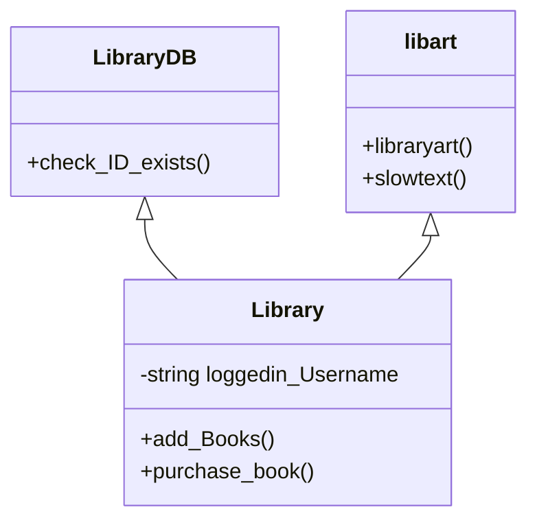

# 📚 Grand Encyclopedia - Advanced Library Management System


> A robust, console-based library application featuring role-based authentication, real-time financial simulation, and persistent file-based database management.

## 📖 Project Overview

The **Grand Encyclopedia** is a C++ application designed to simulate the backend and frontend operations of a digital library. Unlike simple console apps, this project implements a **custom graphical interface** using ASCII art and utilizes **Object-Oriented Programming (OOP)** principles to manage complex user interactions and data persistence.

## 🏗️ System Architecture & Code Explanation

This project relies heavily on C++ OOP concepts. Below is a breakdown of how the code is structured.

### 1. Class Hierarchy (Inheritance)
The system uses **Multiple Inheritance** to separate database logic from UI logic.

* **`LibraryDB` (Backend):** The base class responsible for low-level data validation, such as checking if a Book ID exists in the file stream.
* **`libart` (Frontend):** A dedicated class in `Header.h` that stores all ASCII art, animation delays, and UI helper functions.
* **`Library` (Controller):** The main derived class. It inherits from both `LibraryDB` and `libart`, combining backend data verification with frontend visual elements.



### 2. Data Persistence (File Handling Algorithm)

Since this project does not use SQL, it implements a custom **"Read-Write-Swap"** algorithm to update records (like User Balance or Book Availability) in `.txt` files.

**The Algorithm:**

1. Open the original file (e.g., `Lists.txt`) in **Read Mode**.
2. Open a temporary file (`temp.txt`) in **Write Mode**.
3. Loop through every line of the original file:
* If the line matches the ID/Username to be updated -> **Modify the data** and write to `temp.txt`.
* If the line does not match -> **Copy the data exactly** to `temp.txt`.


4. Close both files.
5. **Remove** the original file and **Rename** `temp.txt` to the original name.

*Code Snippet (from `deduct_user_money`):*

```cpp
while (getline(readFile, tempUsername, ...) ...) {
    if (tempUsername == loggedin_Username) {
        // Calculate new balance and write updated line
        writeFile << tempUsername << "|" << tempPassword << "|" << new_amount << endl;
    } else {
        // Copy existing line
        writeFile << tempUsername << "|" << tempPassword << "|" << tempBalance << endl;
    }
}

```

### 3. Exception Handling

The project avoids standard crashes by implementing custom Exception classes defined in `Header.h`:

* **`FileException`**: Thrown when critical database files (like `Lists.txt`) are missing.
* **`BookNotFoundException`**: Thrown when an Admin tries to remove or a User tries to buy a book ID that doesn't exist.

### 4. User Interface Logic

* **Slow Text Rendering:** The `slowtext()` function uses `std::this_thread::sleep_for` and `std::chrono` to print characters one by one, simulating a retro typing effect.
* **Page-by-Page Reading:** The `bookbypage()` function intelligently parses text files by searching for specific string markers (e.g., "Page 1", "Page 2") to display only the relevant section of a book to the user.

---

## ✨ Application Features

### 🛡️ Role-Based Access

* **Admins:** Full control to add/remove books (`Lists.txt`).
* **Users:** Own a digital wallet. Can deposit funds and buy books. Purchasing checks availability and deducts balance automatically.
* **Guests:** Restricted to "Read-Only" mode (Preview books).

### 📖 content Delivery

* **Previews:** View the table of contents or first chapter.
* **Pagination:** Read full books page-by-page directly in the console.

---

## 🛠️ Installation & Setup

### Prerequisites

* Windows OS (Required for `system("cls")` command).
* Any C++ Compiler (MinGW, Visual Studio, etc.).

### Step-by-Step Guide

1. **Clone the Repo:**
```bash
git clone [https://github.com/YourUsername/Grand-Encyclopedia-LMS.git](https://github.com/YourUsername/Grand-Encyclopedia-LMS.git)

```


2. **Ensure File Structure:**
Make sure the `Books` folder exists and contains `Lists.txt`.
```text
/Grand-Encyclopedia-LMS
├── main_2.cpp
├── Header.h
└── Books/
    └── Lists.txt

```


3. **Compile:**
```bash
g++ main_2.cpp -o library_app

```


4. **Run:**
```bash
./library_app.exe

```


---

## 🧪 Default Login Credentials

To test the system immediately, use these pre-configured accounts:

| Role | Username | Password | Notes |
| --- | --- | --- | --- |
| **Admin** | `admin123` | `123` | Can add/remove books |
| **User** | `wajih` | `123` | Can buy books (Balance: 500) |

---

